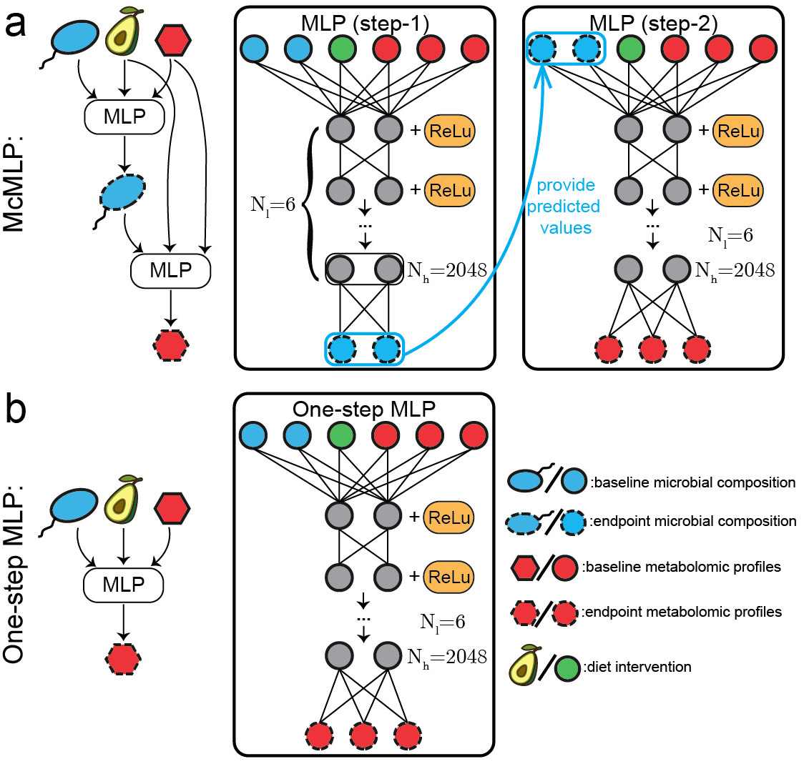

# McMLP (Metabolite response predictor using coupled Multilayer Perceptrons)
This repository contains scripts needed to run `McMLP` that is designed to predict metabolomic profiles after the dietary intervention (i.e., endpoint metabolomic profiles) based on the baseline data (such as the microbial compositions and metabolomic profiles before the dietary intervention) and the dietary intervention strategy. A preprint that describes the method in detail can be found [here](https://doi.org/10.1101/2023.03.14.532589). 


## Versions
The version of Python we used is 3.7.3.

## Dependencies
Necessary Python packages can be found in `requirements.txt`. Installing those packages can be achieved by pip:
```
pip install -r requirements.txt
```

The entire installation process takes less than half an hour for the setting we used (Macbook Air M1 2020, 8GB RAM, 512GB SSD).

## Workflow
1. **Data processing**: we apply the CLR (Centred Log-Ratio) transformation to both tbe microbiota and metabolomic profiles. The dietary intervention strategy is encoded as a binary vector. An example of the processed data of avocado intervention is saved in the folder `./data/avocado_SCFAs`.
2. **McMLP**: the Python script `McMLP.py` loads the processed data in `./data/avocado_SCFAs/processed_data`. The example of running McMLP is available in `McMLP_runner.ipynb`. It starts the training of McMLP on the training data and then makes the final predictions for the endpoint metabolomic profiles. The final predicted CLR-transformed metabolomic profiles are saved as `./results/predicted_metabolomic_profiles.csv`, the true values of CLR-transformed metabolomic profiles are saved as `./results/true_metabolomic_profiles.csv`, and the Spearman Correlation Coefficients for all metabolites are saved as `./results/metabolites_corr.csv`.
3. **Inferring microbe-metabolite interactions**: the Python script `McMLP_inferring_interactions.py` loads the processed data in `./data/avocado_SCFAs/processed_data` and applied the sensitivity analysis to the trained McMLP to capture how microbial relative abundances respond to the perturbation in the intervened food and how the metabolite concentrations respond to the perturbation in the microbial relative abundances. The example of running `McMLP_inferring_interactions.py` is available in `McMLP_runner.ipynb`. All values of sensitivities of microbes towards foods are saved as `./results/sensitivity_diet_and_microbes.csv`. All values of sensitivities of metabolites towards microbes are saved as `./results/sensitivity_diet_and_microbes.csv`.

## Loading data
The loading data comprises both training and test data, which include both input and output data. For the input data, each row represent an individual sample collected before the dietary intervention (i.e., baseline). The columns in the input data are structured to capture three types of information: (1) CLR-transformed baseline microbial abundances, (2) the logarithm of baseline metabolite concentrations, and (3) the dietary intervention strategy. Each row in the output data, on the other hand, corresponds to a sample measured after the dietary intervention (referred as the endpoint). The columns in the output data contain two data types: (1) CLR-transformed endpoint microbial abundances and (2) the logarithm of endpoint metabolite concentrations.

Within the example dataset (located at `./data/avocado_SCFAs/processed_data`), there are specific files designated for different purposes:
* `X_train.csv`: This file contains the input in the training data.
* `y_train.csv`: This file includes the output in the training data.
* `X_test.csv`: It houses the input in the test data.
* `y_test.csv`: This file contains the output in the test data, which is used to evaluate the model's predictive performance.
* `compound_names.csv`: This document lists the names of the metabolites under study.

## Generated data
After the training of McMLP (via executing `McMLP.py`), the well-trained McMLP generates predictions of endpoint metabolite concentrations for the test data, along with the experimentally measured endpoint metabolite concentrations. For the avocado intervention we shown (`results`), `predicted_metabolomic_profiles_wob_0.csv` contains the predicted endpoint metabolite concentrations for the train-test split 1. For this data, each row corresponds to each sample and each column gives the log of predicted endpoint concentration for a metabolite. Following the same way, `true_metabolomic_profiles_wob_0.csv` stores the experimentally measured endpoint metabolite concentrations for the same train-test split. `metabolites_corr_wob_0.csv` documents Spearman Correlation Coefficients for different metabolites. For each metabolite, the Spearman Correlation Coefficient is derived based on its predicted and measured concentrations across samples.

## Inferred sensitivities
The well-trained McMLP can be harnessed to infer food-microbe-metabolite interactions (by running `McMLP_inferring_interactions.py`). It loads the same types of data as `McMLP.py`. The algorithm generates the inferred sensitivities for revealing food-microbe interactions and saves them in `.results/sensitivity_diet_and_microbes.csv`, where each column/row corresponds to each food/microbe. Similarly, the algorithm generates microbe-metabolite sensitivities and saves them in `sensitivity_microbes_and_metabolites.csv`, where each column/row corresponds to each metabolite/microbe.

## Example
We showed an example of training McMLP on the avocado dataset. The command for training and the following prediction is:
```
<PATH_TO_PYTHON> ./McMLP.py NUM_OF_SPLITS PATH_TO_PROCESSED_DATA IF_BASELINE_METABOLOME_INCLUDED
```
<PATH_TO_PYTHON> is the path to the executable Python file located under the installed folder, NUM_OF_SPLITS is the number of train-test splits, PATH_TO_PROCESSED_DATA is the path to the processed data that we want to load to McMLP, and IF_BASELINE_METABOLOME_INCLUDED is a boolean variable to denote whether we would like to include the baseline metabolomic profiles in the input. For the avocado dataset that we demonstrate here, the command for running five train-test splits with the baseline metabolomic profiles is
```
python ./McMLP.py 5 "./data/avocado_SCFAs/processed_data/" True
```
Similarly, to infer interactions via the sensitivity method, we can run `McMLP_inferring_interactions.py`:
 ```
<PATH_TO_PYTHON> ./McMLP_inferring_interactions.py PATH_TO_PROCESSED_DATA IF_BASELINE_METABOLOME_INCLUDED
```
The command on the inference with baseline metabolomic profiles on the real dataset is 
```
python ./McMLP_inferring_interactions.py "./data/avocado_SCFAs/processed_data/" True
```
It is also possible to train McMLP in Jupyter notebooks. One example is provided as `McMLP_runner.ipynb`. The entire running process takes less than 20 minutes for the setting we used (Macbook Air M1 2020, 8GB RAM, 512GB SSD).

## Other datasets
The datasets utilized herein were generated as part of work on bacterial ([Shinn, L. M. et al., The Journal of Nutrition 2021](https://doi.org/10.1093/jn/nxaa285)) and metabolite ([Shinn, L. M. et al., The Journal of Nutrition 2022](https://doi.org/10.1093/jn/nxac195)) biomarkers of food intake, which provided anonymized microbial and metabolomic data. The data related to the fibers or fermented foods intervention study are available for download in the supplemental material of the original publication ([Wastyk et al., Cell 2021](https://doi.org/10.1016/j.cell.2021.06.019)).

* [Shinn, L. M. et al., The Journal of Nutrition 2021: Shinn, Leila M., Yutong Li, Aditya Mansharamani, Loretta S. Auvil, Michael E. Welge, Colleen Bushell, Naiman A. Khan et al. "Fecal bacteria as biomarkers for predicting food intake in healthy adults." The Journal of Nutrition 151, no. 2 (2021): 423-433.](https://doi.org/10.1093/jn/nxaa285)
* [Shinn, L. M. et al., The Journal of Nutrition 2022: Shinn, Leila M., Aditya Mansharamani, David J. Baer, Janet A. Novotny, Craig S. Charron, Naiman A. Khan, Ruoqing Zhu, and Hannah D. Holscher. "Fecal metabolites as biomarkers for predicting food intake by healthy adults." The Journal of Nutrition 152, no. 12 (2022): 2956-2965.](https://doi.org/10.1093/jn/nxac195)
* [Wastyk et al., Cell 2021: Wastyk, Hannah C., Gabriela K. Fragiadakis, Dalia Perelman, Dylan Dahan, Bryan D. Merrill, B. Yu Feiqiao, Madeline Topf et al. "Gut-microbiota-targeted diets modulate human immune status." Cell 184, no. 16 (2021): 4137-4153.](https://doi.org/10.1016/j.cell.2021.06.019)


## License

This project is covered under the **MIT License**.